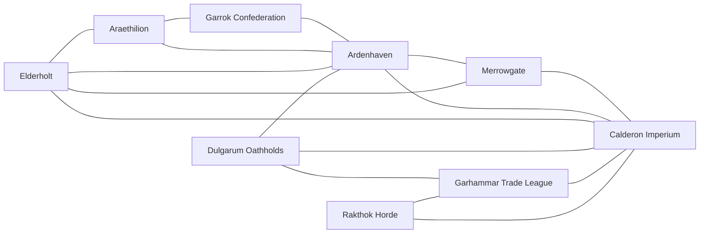

# Faction Proximity & Influence (Map Interaction Graph)

Goal: make it easy (for you and an LLM) to pick the **most likely interacting factions** when generating timelines, plots, and “who shows up” consequences.

This file separates:
- **Proximity** = who is physically near who (borders, chokepoints, sea lanes).
- **Influence** = who meaningfully affects who (trade dependence, rivalry, alliances, ideology, covert reach).

> Map note: the **adjacency list is map-verified**; the influence tables remain draft estimates. If any border/route changes, update the adjacency list first—everything else depends on it.

## Nodes (Polities)

- **Ardenhaven** — realm (capital: Ardenford)
- **Calderon Imperium** — empire (capital: Ironstead)
- **Merrowgate** — city-state / trade hub (city: Merrowgate)
- **Elderholt** — hidden coven micro-realm (Elderstead)
- **Garrok Confederation** — tribal confederation
- **Rakthok Horde** — nomadic horde alliance
- **Dulgarum Oathholds** — dwarven holds
- **Garhammar Trade League** — guild-league / industrial trade polity
- **Araethilion** — theocratic autocracy (capital: Aeralithil)

## Proximity Graph (Undirected)

### Adjacency List (Map-Based)

- **Ardenhaven**: Calderon Imperium, Garrok Confederation, Merrowgate, Araethilion, Elderholt (near-sea)
- **Calderon Imperium**: Ardenhaven, Rakthok Horde, Merrowgate, Garhammar Trade League, Dulgarum Oathholds, Elderholt (near-sea)
- **Merrowgate**: Ardenhaven, Calderon Imperium, Elderholt (sea lane)
- **Elderholt**: Merrowgate, Ardenhaven (sea lane), Calderon Imperium (sea lane), Araethilion (sea lane)
- **Garrok Confederation**: Ardenhaven, Araethilion (mountain-border / pass)
- **Araethilion**: Ardenhaven, Garrok Confederation (pass), Elderholt (sea lane)
- **Dulgarum Oathholds**: Garhammar Trade League, Ardenhaven
- **Garhammar Trade League**: Dulgarum Oathholds, Calderon Imperium, Rakthok Horde
- **Rakthok Horde**: Calderon Imperium, Garhammar Trade League

### Mermaid Diagram (LLM-Friendly)

## Influence Model (Directed, 0–5)

### Scale

- `0` none/unknown
- `1` faint (rare contact; distant interest)
- `2` low (occasional trade, rumors, or minor border contact)
- `3` moderate (regular contact; meaningful leverage; recurring disputes)
- `4` high (major ally/rival; strong dependency; frequent friction)
- `5` defining (existential threat, hegemon, or “everything is downstream of this relationship”)

### Default Rule

- If a pair is **not listed** under a faction, assume `0–1` depending on distance and the current campaign era.

### Per-Faction Influence Lists (v0)

#### Ardenhaven → others

| Target | Score | Why |
|---|---:|---|
| Calderon Imperium | 4 | Border rival; competing models of lawful order; war legacy. |
| Merrowgate | 3 | Trade access and arbitration leverage; “neutral” hub pressure. |
| Garrok Confederation | 3 | Mutual defense + treaty diplomacy; trust earned by oath-keeping. |
| Garhammar Trade League | 2 | Arms/trade ties exist, but Ardenhaven tries to avoid dependence. |
| Araethilion | 2 | Neighboring power with soft influence (healing/art/culture). |
| Elderholt | 2 | Petition-based favors; fear/respect makes small contacts high impact. |
| Dulgarum Oathholds | 2 | Mountain-adjacent; travel and trade routes make relations hard to ignore. |
| Rakthok Horde | 1 | Mostly indirect; border news and propaganda spillover. |

#### Calderon Imperium → others

| Target | Score | Why |
|---|---:|---|
| Ardenhaven | 5 | Primary rival frontier; strategic priority. |
| Rakthok Horde | 4 | Active raiding frontier; “enemy shaping doctrine.” |
| Garhammar Trade League | 4 | Major arms/industry client relationship; mutual leverage. |
| Merrowgate | 3 | Trade and information dependence; neutrality constraints. |
| Dulgarum Oathholds | 3 | Shared mountains; defensive pacts and mutual suspicion. |
| Garrok Confederation | 2 | Scouts/border contact; potential pressure point vs Ardenhaven. |
| Araethilion | 2 | Distant but consequential magical/theocratic neighbor. |
| Elderholt | 2 | Low contact, but outsized threat/potential as “unconventional deterrent.” |

#### Merrowgate → others

| Target | Score | Why |
|---|---:|---|
| Ardenhaven | 4 | Strong commercial leverage; contracts and debt as control points. |
| Calderon Imperium | 4 | Neutral trade + permits + arbitration; pressure valve for tensions. |
| Garhammar Trade League | 3 | Shared contract culture; trade/arbitration partnership. |
| Araethilion | 3 | Enchanted goods channel; diplomacy via commerce. |
| Rakthok Horde | 2 | “Occasional deals” for weapons and logistics. |
| Garrok Confederation | 2 | Trade interface through Ardenhaven and border markets. |
| Dulgarum Oathholds | 2 | High-value goods markets; cautious contracts. |
| Elderholt | 2 | Proximity by sea; rare but high-stakes bargains. |

#### Elderholt → others

| Target | Score | Why |
|---|---:|---|
| Ardenhaven | 2 | Petitions and quiet interventions; prefers limited entanglement. |
| Calderon Imperium | 2 | Watches threats; avoids open conflict; potential for rare “hard favors.” |
| Merrowgate | 2 | Closest hub; the easiest place to trade information/favors discreetly. |
| Araethilion | 1 | Sea-near but politically distant; contact likely via intermediaries. |
| Garrok Confederation | 1 | Mostly rumor-level, unless a blood-oath crosses the forest. |
| Rakthok Horde | 1 | Mostly distant; some shared “spirit-law” themes but no routine ties. |
| Dulgarum Oathholds | 1 | Distant; deep threats might force indirect contact. |
| Garhammar Trade League | 1 | Distant; contracts rarely bind what the coven wants. |

#### Garrok Confederation → others

| Target | Score | Why |
|---|---:|---|
| Ardenhaven | 4 | Treaty partner; mutual defense; honor-law interoperability. |
| Calderon Imperium | 2 | Scout contact and border disputes; not full-scale war. |
| Rakthok Horde | 2 | Ideological rivalry (“weak/compromised” vs “savage”) and orc politics. |
| Merrowgate | 2 | Trade access; cautious dealings through contract markets. |
| Araethilion | 1 | Neighbor-by-pass; limited direct overlap. |
| Elderholt | 1 | Fear-respect rumors; rare direct dealings. |
| Dulgarum Oathholds | 1 | Distant; dwarven trade contacts via Ardenhaven/Merrowgate. |
| Garhammar Trade League | 1 | Distant; arms as temptation but politically risky. |

#### Rakthok Horde → others

| Target | Score | Why |
|---|---:|---|
| Calderon Imperium | 4 | Primary enemy shaping raids, doctrine, and survival logic. |
| Garhammar Trade League | 3 | Practical supply pressure; weapons and gear channels. |
| Merrowgate | 2 | Occasional deals; leverage through “neutral” merchants. |
| Garrok Confederation | 2 | Rival narrative and orc legitimacy contests. |
| Ardenhaven | 1 | Mostly indirect (via Calderon propaganda and border spillover). |
| Dulgarum Oathholds | 1 | Distant; mountains are barriers. |
| Araethilion | 1 | Distant. |
| Elderholt | 1 | Distant/unknown. |

#### Dulgarum Oathholds → others

| Target | Score | Why |
|---|---:|---|
| Garhammar Trade League | 4 | Core schism/rival; ideological and economic conflict. |
| Calderon Imperium | 3 | Neighboring power; defensive pacts and mutual threat awareness. |
| Merrowgate | 2 | High-value trade; cautious contracting. |
| Ardenhaven | 2 | Direct neighbor; surface routes and diplomacy shape the holds’ day-to-day. |
| Elderholt | 1 | Distant/unknown; “deep threats” could change this quickly. |
| Araethilion | 1 | Distant. |
| Garrok Confederation | 1 | Distant. |
| Rakthok Horde | 0 | No routine ties known. |

#### Garhammar Trade League → others

| Target | Score | Why |
|---|---:|---|
| Calderon Imperium | 4 | Major client; industrial-military interdependence. |
| Merrowgate | 3 | Arbitration/trade partner; shared contract-first worldview. |
| Dulgarum Oathholds | 3 | Schism rivalry; kin politics; trade-with-teeth. |
| Ardenhaven | 2 | Trade/arms links exist; Ardenhaven tries not to be captured by it. |
| Rakthok Horde | 2 | Neighboring market and threat; opportunistic dealings possible. |
| Araethilion | 1 | Distant luxury market for elven goods. |
| Garrok Confederation | 1 | Distant. |
| Elderholt | 1 | Distant. |

#### Araethilion → others

| Target | Score | Why |
|---|---:|---|
| Merrowgate | 3 | Primary external interface via trade; controlled diplomacy. |
| Ardenhaven | 2 | Neighbor; “soft power” in healing/art, but politically aloof. |
| Garrok Confederation | 1 | Pass-neighbor; limited overlap unless borders flare. |
| Calderon Imperium | 1 | Distant; consequential if expansion threatens sacred borders. |
| Elderholt | 1 | Sea-near; rare contacts via intermediaries. |
| Dulgarum Oathholds | 0 | Distant. |
| Garhammar Trade League | 0 | Distant. |
| Rakthok Horde | 0 | Distant. |
