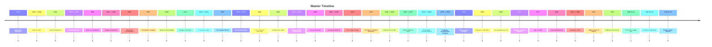

# Master Timeline

```mermaid
timeline
    title Master Timeline
    4150 : Age of Iron Dominion
    4150 --> 4199 : Imperial Wars
    4150 : The First Marches
    4152 --> 4160 : Ash Road Corps
    4156 : Battle of Hawkridge
    4161 --> 4162 : Siege of Ardenford
    4162 : Neutrality Proclamation
    4165 : The Ardenic Treaties
    4168 : Battle of Stonebridge
    4171 : Winter Levy Riots
    4173 --> 4174 : The Grain Crisis
    4182 : The Charter Revolt
    4188 --> 4193 : The Arms Accords
    4199 : The Ironstead Stalemate
    4200 : Pentarch Accords
    4201 --> 4203 : Border Survey Commission
    4203 : Council Reforms
    4206 --> 4208 : Censorate Reform
    4210 : The Forgery Purge
    4230 : The Silent Compact Renewed
    4240 --> 4242 : Silent Cohort Trials
    4245 --> 4247 : Border Raids of 4245
    4251 --> 4254 : Breachgate Reinforcements
    4255 --> 4259 : Refugee Resettlement Program
    4260 : The Insurance Compact
    4265 : War Moot of Borders
    4268 : The Lifelume Accord
    4270 : Warding Compact Renewal
    4277 : Age of Trade
    4281 : Canal Tariff Reform
    4284 --> 4289 : Arbitration Push
    4312 : Night Auction of Names
    4315 : Elderholt Veil Project
    4326-11-12 : The Silent Ledger Job
    4327-07-12 : Arrival in Ardenford
    4327-07-18 : Border Signal Mission
```
